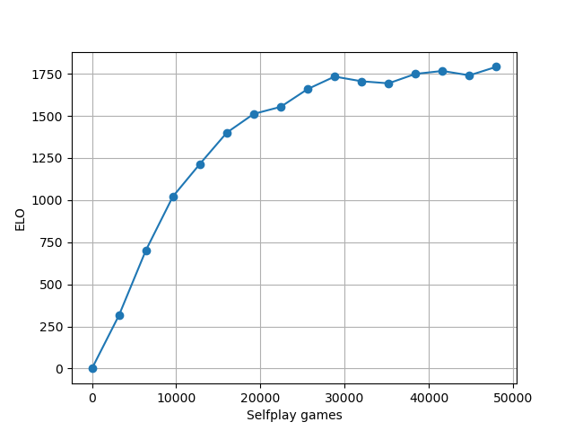

# DLChess

DLChess is a small project that was used to test and investigate deep reinforcement learning for chess.  It implements an [AlphaZero](https://arxiv.org/abs/1712.01815)-style model that combines Monte Carlo Tree Search (MCTS) with a neural network for policy and value prediction.  The primary goal was to explore how strong the program could become using a relatively small neural network together with selfplay and training on modest hardware.

Refer to the [Documentation](https://mcfarljm.github.io/dlchess/) for more details about the [Design](https://mcfarljm.github.io/dlchess/design/), information about [Training Runs](https://mcfarljm.github.io/dlchess/training-runs/), as well as [Sample Games](https://mcfarljm.github.io/dlchess/sample-games/) played against the networks.

The design and implementation of the algorithm follows the sister project [DLGo](https://github.com/mcfarljm/dlgo), which itself largely followed the book [Deep Learning and the Game of Go](https://www.manning.com/books/deep-learning-and-the-game-of-go).  The implementation of the chess board structure, rules, and move generation follows [Chareth](https://github.com/mcfarljm/chareth).

The code is written in C++.  The neural networks are defined in PyTorch and exported to ONNX format for evaluation in the C++ code, which is currently done using the ONNX runtime.  This was found to provide about a 2.5x speedup relative to use of TorchScript and LibTorch.

## Features

* AlphaZero-style engine that combines MCTS with a multi-output neural network.
  * Dirichlet random noise added to move priors at the root node of each search.
  * Accommodates both greedy and proportional move selection based on visit counts.
  * Monte Carlo Tree Search is done in serial, dynamic memory is used for tree expansion, and the search tree is reset for each move.
  * Neural network results are cached using a fixed-size map with a first-in, first-out eviction policy.
* Support for UCI communication protocol.
* Complete framework for self-play and training.  The [`run_training.sh`](scripts/run_training.sh) Bash script is provided as an example for fully-automated and parallelized self-play and training updates.

## Usage

CMake and ONNX Runtime are required to build and run the engine using an existing neural network file.  PyTorch is required for training.

* `mkdir build; cd build; cmake .. -DONNXRUNTIME_ROOTDIR=<path-to-onnxruntime> -DCMAKE_BUILD_TYPE=RELEASE; make`
* Run tests using `ctest`
* See usage information for the UCI driver: `./dlchess -h`
* See usage information for the self-play driver: `./selfplay -h`
* To run self-play training iterations, see the [`run_training.sh`](scripts/run_training.sh) example script, which provides a starting point.

Refer also to the provided [`Dockerfile`](Dockerfile), which prepares a container with all tools necessary training, selfplay, and evaluation using cutechess-cli.

## Design

The neural network is implemented using PyTorch.  During training, two versions of the network data are retained: (1) the network weights for use in subsequent training updates, and (2) an ONNX export for use in the C++ code.

The experience data generated during self-play are stored in a simple raw binary format with accompanying metadata in json.  This makes it possible to efficiently load and take subsets of the data in Python during training using [`numpy.memmap`](https://numpy.org/doc/stable/reference/generated/numpy.memmap.html).

For each game, the experience data include:

* A tensor describing the input state before each move.
* A tensor describing the MCTS visit counts associated with each move (used as the target for the policy network).
* A tensor describing the reward (game outcome) associated with each move.

## Details of the main training run

Following are details for the main training run.

### Input encoder

The main run uses a simple 21-plane feature encoder, adapted from the encoder used by [AlphaZero](https://arxiv.org/abs/1712.01815):

* Planes 0-11: occupation for each white and black piece
* Planes 12-13: flags for single and double repetition
* Plane 14: color of side to move
* Plane 15: constant plane (to help with edge detection)
* Plane 16-19: castling permissions
* Plane 20: no progress count

The differences from [AlphaZero](https://arxiv.org/abs/1712.01815) are:

* No history is used (i.e., only a 1-step history as opposed to an 8-step history)
* The total move count has been replaced by a constant plane

### Network architecture

The neural network architecture used for the main run is defined in `nn/nine/conv_4x64.py`.  It is a miniature, simplified version of the architecture used by [AlphaZero](https://arxiv.org/abs/1712.01815).

The input to the network is a $8 \times 8 \times 21$ image stack comprising 21 feature planes as outlined in the previous section.

The input features are processed by a tower of 4 convolutional blocks with 64 filters, batch normalization, and ReLU activation.  The output of this tower than feeds two separate "heads" for computing the policy and value.

The policy head includes an additional convolutional block with 64 filters and ReLU activation, followed by a final convolution with 73 filters that outputs the policy tensor.  The policy tensor encodes moves in the same format used by AlphaZero.

The value head includes a convolution with 1 filter, followed by a fully-connected linear layer with 256 outputs and ReLU activation, followed by a linear layer outputting a scalar, and finally a tanh mapping to the range +/-1.

### Algorithm settings

Move selection:

* 800 MCTS rounds are used during self-play and model evaluation.
* Dirichlet noise is added to the root node with a concentration parameter equal to $0.03 \times 19 \times 19 / n_{moves}$, following [Katago](https://arxiv.org/abs/1902.10565).
* During self-play, the first 15 full moves (30 half-moves) are selected randomly in proportion to visit counts, and remaining moves are selected greedily based on maximum visit count.
* Tree search is done in serial.  During self-play, parallelization is accomplished by running multiple processes.

Self-play:

* Self-play games were assigned a draw outcome if the game exceeded 256 half-moves.
* Each iteration consisted of 3,200 self-play games, after which a training update was performed.

Training:

* Training batch size was 256 moves.
* For each training iteration, all move data generated during the previous self-play iteration were used.  For example, supposing 100 moves per game, we have $100 \times 3,200 = 320,000$ moves for training.  With a batch size of 256, this corresponds to roughly 1,250 training steps.
* Stochastic gradient descent was used with a learning rate of 5e-3.

Evaluation:

* Strength was evaluated relative to the previous version after each training iteration.
* During evaluation, Dirichlet noise was disabled and all moves were selected greedily based on visit count.  Evaluation used 800 playouts (the same as selfplay).
* 200 games were played, with each player playing both sides from 100 standard opening positions after 6 ply.
* Evaluation games were limited to 100 full moves, after which they were adjudicated a draw.
* Evaluation was performed using cutechess-cli.

### Computational setup

The main training run was done on an Amazon EC2 instance with 8 virtual CPUs.  To obtain the best self-play throughput with the serial MCTS implementation, 8 self-play processes were run concurrently, and neural network model evaluation for each process was configured to use one thread.  Typical throughput was approximately 2.35 moves per second per process, for a total of approximately 18.8 moves per second.  A typical self-play iteration consisting of 400 games per worker (3,200 total) took about 7 hours.  After generating self-play data, the training update was fast, taking on the order of minutes.

### Results

Each iteration of the neural network was evaluated against the previous version for 200 games (each agent plays 100 games as black and white from standard opening positions).  During the evaluation games, 800 MCTS rounds were used, Dirichlet noise was not included, and move selection was done greedily based on node visit count.

The below figure plots the estimated relative ELO as a function of the number of selfplay games, using 0 as an arbitrary starting point.

