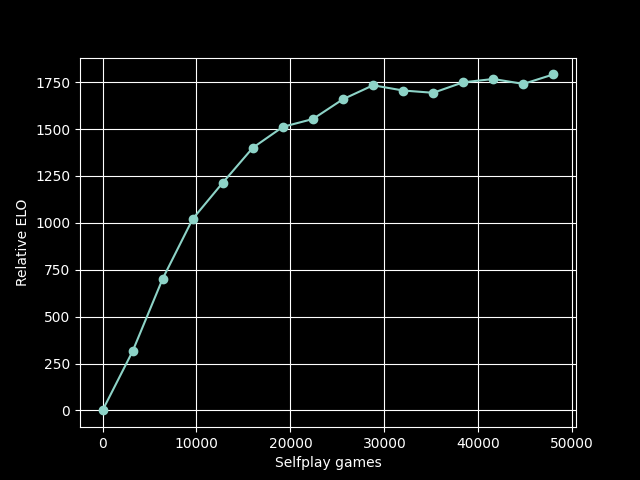
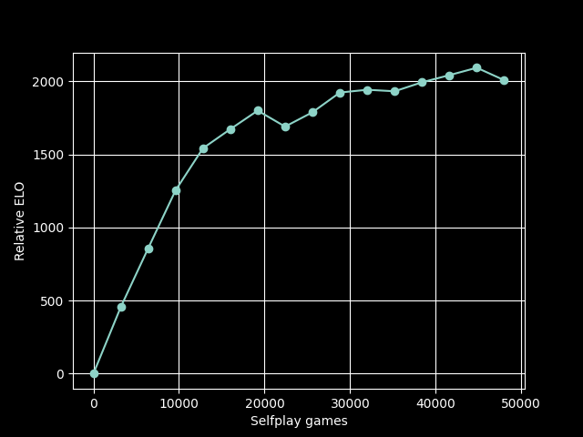

# Training Runs

A training run is an iterative proces that alternates between using the model in
selfplay mode to generate game data, followed by a training update of the neural network
weights.  All training runs were conducted using modest hardware with between 4 and 8
CPU cores.  Each training run begins by randomly initializing the weights of the
neural network.

The naming scheme is as `v{MAJOR_VER}.{INCREMENT}`, where `MAJOR_VERSION` indicates the
training run number, and `{INCREMENT}` denotes the number of training updates that have
been made within that training run.  For example, `v4.0` corresponds to the randomly
initialized network for training run 4, and `v4.5` corresponds to the network in
training run 4 after 5 updates.

In the table below, "Estimated ELO" is just a very rough estimate of the engine strength
relative to rapid ratings on chess.com.  This is based on playing against the engine in
5 minute time controls.

| Network | Filters | Blocks | Block Type  | Games  | Estimated ELO | Comments                                                     |
|---------|---------|--------|-------------|--------|---------------|--------------------------------------------------------------|
| v4.15   | 64      | 4      | Convolution | 48,000 | 1100          | First successful training run                                |
| v8.15   | 64      | 4      | Convolution | 48,000 | 1175          | Added en passant square to network input; updated parameters |

The below plots show estimated strength as a function of training history.  Note that
the y-axis is a relative ELO, which is set to 0 for the randomly initialized network.
Relative ELO is calculated after each training update by running a 200-game tournament
between the new network and the previous version.  In this tournament, both models play
each side from 100 different standard opening positions.  Search is fixed at 800
playouts.

<figure markdown="span">
  { width=480 }
  <figcaption>Training history for network v4.15</figcaption>
</figure>

For network v8.15, we see that the final relative ELO is about 250 points above what is
reached by v4.15.  However, these two models were played against each other, and based
on 200 games v8.15 is estimated to only be about 80 points stronger.  The discrepancy
might be based on accumulated statistical error in how relative ELO is being computed, or
some difference in the initial strengths.

<figure markdown="span">
  { width=480 }
  <figcaption>Training history for network v8.15</figcaption>
</figure>
