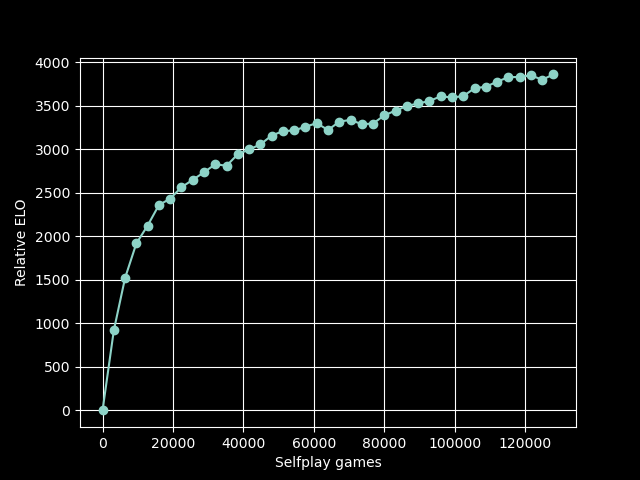
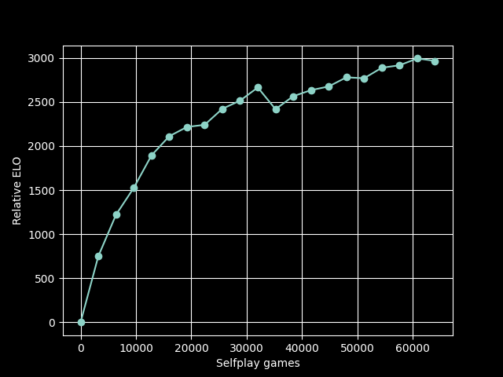

# Training Runs

This page documents and compares different neural networks that have been trained
through reinforcement learning.  Each *training run* starts from a randomly initialized
neural network and iterates between selfplay and training updates.  All training runs
were conducted using modest hardware with between 4 and 8 CPU cores.

## Results

The following summarizes results for different training runs.  The naming scheme is
`v{MAJOR_VER}.{INCREMENT}`, where `MAJOR_VERSION` indicates the training run number, and
`{INCREMENT}` denotes the number of training updates that have been made within that
training run.  For example, `v4.0` corresponds to the randomly initialized network for
training run 4, and `v4.5` corresponds to the network in training run 4 after 5 updates.

The table below gives a summary for a selected set of training runs.  "Size" specifies
the size of the neural network architecture in terms of number of blocks and number of
filters (e.g., 4 blocks with 64 filters).  "Games" refers to the total number of
selfplay games used for training.  "ELO" is based on comparison against other
engines with similar strength from the [CCRL blitz
ratings](https://computerchess.org.uk/ccrl/404/) in 2+1 blitz matches.

| Network | Size   | Block Type         | Games   | ELO  | Comments                                                     |
|---------|--------|--------------------|---------|------|--------------------------------------------------------------|
| v14.40  | 5 x 64 | Squeeze Excitation | 128,000 | 1380 | Increased number of blocks                                   |
| v12.25  | 4 x 64 | Squeeze Excitation | 80,000  | 1263 | Added squeeze-excitation layer to residual blocks            |
| v11.25  | 4 x 64 | Residual           | 80,000  | 1192 | Board oriented towards side to move                          |
| v9.20   | 4 x 64 | Residual           | 64,000  | 1042 | First run with residual blocks                               |
| v8.15   | 4 x 64 | Convolution        | 48,000  | 820  | Added en passant square to network input; updated parameters |
| v4.15   | 4 x 64 | Convolution        | 48,000  | 789  | First successful training run                                |

The below plots show estimated strength as a function of training history.  Note that
the y-axis is a relative ELO, which is set to 0 for the randomly initialized network.
Relative ELO is calculated after each training update by running a 200-game tournament
between the new network and the previous version.  In this tournament, both models play
each side from 100 different standard opening positions.  Search is fixed at 800
playouts.

<figure markdown="span">
  { width=480 }
  <figcaption>Training history for network v14.40</figcaption>
</figure>

<figure markdown="span">
  { width=480 }
  <figcaption>Training history for network v12.25</figcaption>
</figure>

<figure markdown="span">
  { width=480 }
  <figcaption>Training history for network v11.25</figcaption>
</figure>

<figure markdown="span">
  { width=480 }
  <figcaption>Training history for network v9.20</figcaption>
</figure>

<figure markdown="span">
  { width=480 }
  <figcaption>Training history for network v8.15</figcaption>
</figure>

<figure markdown="span">
  { width=480 }
  <figcaption>Training history for network v4.15</figcaption>
</figure>

## Settings

### Move selection

* 800 MCTS rounds are used during self-play and model evaluation.
* Dirichlet noise is added to the root node with a concentration parameter equal to $0.03 \times 19 \times 19 / n_{moves}$, following [Katago](https://arxiv.org/abs/1902.10565).
* Self-play
    * Network v5 and later: all moves are selected randomly in proportion to visit count.
    * Network v4 and earlier: the first 15 full moves (30 half-moves) are selected randomly in proportion to visit counts, and remaining moves are selected greedily based on maximum visit count.
* Tree search is done in serial.  During self-play, parallelization is accomplished by running multiple processes.

### Self-play

* Self-play games were assigned a draw outcome if the game exceeded 256 half-moves.
* Each iteration consisted of 3,200 self-play games, after which a training update was performed.

### Training

* Training batch size was 256 moves.
* For each training iteration, all move data generated during the previous self-play
  iteration were used.  For example, supposing 100 moves per game, we have $100 \times
  3,200 = 320,000$ moves for training.  With a batch size of 256, this corresponds to
  roughly 1,250 training steps.
* Stochastic gradient descent was used with a learning rate of 5e-3.

### Evaluation

* Strength was evaluated relative to the previous version after each training iteration.
* During evaluation, Dirichlet noise was disabled and all moves were selected greedily
  based on visit count.  Evaluation used 800 playouts (the same as selfplay).
* 200 games were played, with each player playing both sides from 100 standard opening
  positions after 6 ply.
* Evaluation games were limited to 150 full moves, after which they were adjudicated a draw.
* Evaluation was performed using cutechess-cli.

## Hardware

Training runs beginning with v9 were done using a refurbished Lenovo ThinkCentre mini pc
with an Intel Core i7 having 4 cores and 8 threads.  Some initial issues with
overheating had to be resolved by limiting the clock speed to 2.7 GHz.  Selfplay was
done using the serial MCTS implementation with 4 self-play processes running
concurrently, each using a single thread for network inference.  Due to the use of a
cache for network inference, throughput increases over the course of model training.  At
iteration v9.5, throughput was about 2.83 moves per second per process, for a total of
approximately 11.32 moves per second.  A typical self-play iteration consisting of 800
games per worker (3,200 total) took about 10 hours, followed by an hour or so for the
training update and strength evaluation.

Earlier training runs were done on an Amazon EC2 instance with 8 virtual CPUs.  To
obtain the best self-play throughput with the serial MCTS implementation, 8 self-play
processes were run concurrently, and neural network model evaluation for each process
was configured to use one thread.  Typical throughput was approximately 2.35 moves per
second per process, for a total of approximately 18.8 moves per second (this was before
network caching was implemented in dlchess).  A typical self-play iteration consisting
of 400 games per worker (3,200 total) took about 7 hours.  After generating self-play
data, the training update was fast, taking on the order of minutes.
